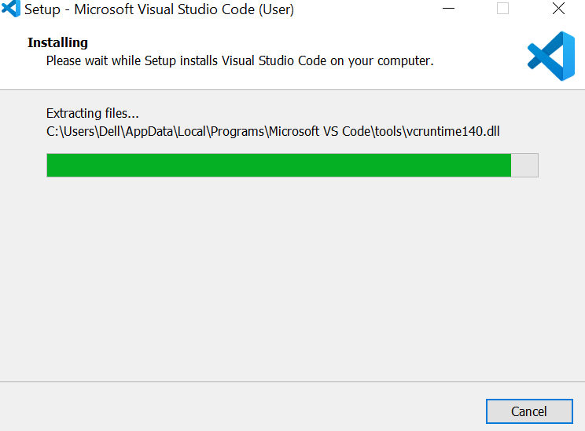

# python_dataviz

## นางสาวพฺุธิตา เจือจันทร์
## รหัสนักศึกษา 603021879-8

# การติดตั้ง Anaconda Prompt เพื่อใช้งาน Jupyter
 
### ขั้นตอนที่ 1 ทำการติดตั้ง Anaconda Prompt โดยเสิร์ชว่า Minicanda

### ขั้นตอนที่ 2 ทำการติดตั้งตาม ขนาดของเครื่อง 32 bit / 64 bit โดยเช็คได้จาก Properties จากนั้นเลือกขนาดและเวอร์ชั่นที่ต้องการติดตั้ง'

### เมื่อติดตั้งลงเครื่องแล้ว เลือก Next และ Agree ไปเรื่อยๆ จนติดตั้งสำเร็จ

### ขั้นตอนที่ 4 เมื่อทำการติดตั้งเป็นที่เรียบร้อยแล้ว ให้สร้างโฟลเดอร์ที่ใช้สำหรับเก็บงาน 

### ขั้นตอนที่ 5 เมื่อทำการติดตั้งเรียบร้อยแล้ว ให้เปิดโปรแกรม Anaconda Prompt พร้อมเลือกโพลเดอร์ที่ต้องการจะเก็บข้อมูลโดยพิม cd ตามด้วย โฟลเดอร์ ( cd “C:\dataviz”)

### ขั้นตอนที่ 6 จากนั้นทำการเช็คแพ็คเกจที่มีในโปรแกรม โดยใช้คำสั่ง pip freeze

### ขั้นตอนที่ 7 ถ้าไม่มีแพ็คเกจ ทำการติดตั้ง โดยใช้คำสั่ง >conda install matplotlip และ >conda install jupyter
### ขั้นตอนที่ 8 ทำการเช็คเวอร์ชั่นของ python โดยการพิมพ์ > python

### ขั้นตอนที่ 9 จากนั้นเรียกใช้งาน jupyter โดยใช้คำสั่ง >jupyter notebook 

### ขั้นตอนที่ 10 เมื่อเด้งมาหน้า Home page ใน jupyter สามารถเลือกหน้าใหม่ที่จะทำการเขียนโค้ดและตั้งชื่อได้โดยไปที่ >New>python3

# การใช้งาน jupyter บน cloud (Google Colab)
### ขั้นตอนที่ 1 เข้าgoogle เสิร์ชว่า colab.research.google.com 

### ขั้นตอนที่ 2 ทำการ side in เข้าระบบโดยใช้ mail ของตนเอง เมื่อ side in แล้ว google colab จะแสดงไฟล์ที่เราบันทึกไว้และสามารถทำการแก้ไขได้

### ถ้าจำทำการเขียนโปรแกรมโดยใช้ไฟล์ใหม่สามารถเลือก New python 3 notebok

### ขั้นตอนที่ 4 เมื่อมาที่หน้าใหม่ สามารถเขียนโปรแกรมได้ตามปกติ

# การติดตั้งและใช้งาน Git Hub
### ขั้นตอนที่ 1 เสิร์ช Github.com

### ขั้นตอนที่ 2 ทำการ side in เข้า github ด้วย mail ของตนเอง

### ขั้นตอนที่ 3 จากนั้นทำการตั้งชื่องาน โดยไปที่ Repositoy name

### ขั้นตอนที่ 4 ทำการ install github ใน Anaconda โดยเสิร์ชคำว่า Anaconda install git 

### ขั้นตอนที่ 5 เมื่อทำการสร้างไฟล์งานเสร็จ จะทำการ clone ไฟล์โดยไปยังAnaconda prompt แล้วทำการคัดลอก ลิงค์ที่ปุ่มสีเขียว clone or download 

### ขั้นตอนที่ 6 จากนั้นใช้คำสั่ง >git clone ตามด้วย URL จากที่กล่าวข้างต้น 

### ขั้นตอนที่ 7 จากนั้นเช็คว่ามีไฟล์ไหนบ้าง โดยใช้คำสั่ง > dir

### ขั้นตอนที่ 8 จากนั้นเช็คว่ามีไฟล์ใดยังไม่เข้าหรือเชื่อมบ้างโดยใช้คำสั่ง >git status (ถ้าขึ้นตัวหนังสือสีแดง แสดงว่ายังไม่เข้า)

### ขั้นตอนที่ 9 จากนั้นใช้คำสั่ง > git add (ตามด้วยชื่อไฟล์) เพื่อที่จะแอดไฟล์นั้นเข้าไป จากนั้นใช้คำสั่ง >git commit -m “test git” เพื่อที่จะคีย์ mail และ username ที่เราสมัครไว้

### ขั้นตอนที่ 10 จากนั้นใช้คำสั่ง >git push เพื่อที่จะดันหรือส่งไฟล์ให้ขึ้นไปอยู่บน internet (โดยจะมีusername กับ passwordให้กรอก)

### ขั้นตอนที่ 11 ไฟล์ชื่อ "Day1 03.01.2020.ipynb" เข้าไปอยู่บน internet เมื่อถูกโคลนเรียบร้อย 

# การติดตั้ง Visual 
### ขั้นตอนที่ 1 เสิร์ชว่า Visual studio code

### ขั้นตอนที่ 2 ทำการ download แล้ว Next ไปเรื่อยๆจนกว่าจะทำการติดตังสำเร็จ

### ขั้นตอนที่ 3 ทำการ install เสร็จสมบูรณ์และสามารถใช้โปรแกรมได้ตามปกติ

# การแทรกรูปใน Visual
### ขั้นตอนที่ 1 เสิร์ชว่า markdown cheat sheet เลือกเว็บ "Markdown Cheat Sheet | Markdown Guide"

### ขั้นตอนที่ 2 จากนั้นทำการเลือกว่าต้องการจะใช้ในการแทรกรุปภาพหรือเว็บไซต์ ในกรณนี้จะทำการแทรกรูป จึงเลือกคำสั่ง ""

